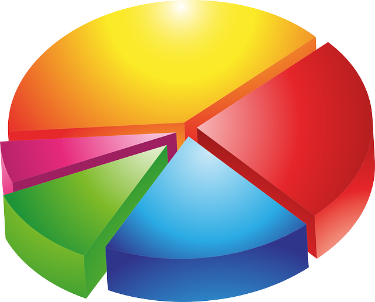

<div style= "float:right;position: relative; margin-left: 20px">
```{r setup, echo=FALSE, fig.align="right", }

```
</div>

Given below are two data visualizations that violate many data visualization 
best practices. Improve these visualizations using R and the tips for effective 
visualizations that we introduced in class. You should produce one visualization 
per dataset. Your visualizaiton should be accompanies by a brief paragraph 
describing the choices you made in your improvement, specifically discussing 
what you didn't like in the original plots and why, and how you addressed them 
in the visualization you created.

On the due date you will give a brief presentation describing one of your 
improved visualizations and the reasoning for the choices you made.

## Exercises

1. **Fisheries**: Fisheries and Aquaculture Department of the Food and 
Agriculture Organization of the United Nations collects data on fisheries 
production of countries. [This Wikipedia page](https://en.wikipedia.org/wiki/Fishing_industry_by_country) 
lists fishery production of countries for 2005. For each country tonnage from 
capture and aquaculture are listed. Note that countries which harvested less 
than 100,000 tons are not included in the data. The source data can be found 
in the `fisheries` dataset in the **dsbox** package. The following plots were 
produced based off the data given on the Wikipedia page.

<!--  -->


```{r answer1, fig.align = 'right', warnings = F, message = F, error = F, eval = T, echo = F, fig.height = 10, fig.fullwidth = T}
# Answer question here. The following two lines will help you to install hard to find libraries.
if(!require(devtools)){install.packages("devtools")}
if(!require(dsbox)){devtools::install_github("rstudio-education/dsbox")}
if(!require(datasauRus)){install.packages("datasauRus")}
library(tidyverse)

 # ?fisheries
options(scipen = 99)
library(scales)
# 
library(reshape2)
melted_fisheries = melt(fisheries, id = "country")

# ggplot(data = melted_fisheries,
#         mapping = aes(x = country,
#                       y = value,
#                       group = variable))+
#     geom_col(position = "dodge")+
#     coord_flip()+
#     scale_y_continuous(labels = comma)

df = fisheries %>%
    arrange(capture)
df$country = factor(df$country, levels = df$country)

p1 = ggplot(data = df[42:75,],
        mapping = aes(x = country,
                      y = capture))+
    geom_col(fill = "grey")+
    coord_flip()+
    scale_y_continuous(labels = comma)+
    labs(title = "Capture",
       subtitle = "(Countries Capturing 90% of Fish)")+
     theme_light()
       


df[is.na(df$aquaculture),"aquaculture"] = 0

df = df %>%
    arrange(aquaculture)


df$country = factor(df$country, levels = df$country)

sum(df$aquaculture[1:41]) / sum(df$aquaculture)


p2 = ggplot(data = df[42:75,],
        mapping = aes(x = country,
                      y = aquaculture))+
    geom_col(fill = "blue")+
    coord_flip()+
    scale_y_continuous(labels = comma)+
    labs(title = "Aquaculture",
       subtitle = "(90% of Aquaculture)")+
    theme_light()

library(gridExtra)

grid.arrange(p1,p2, nrow =1)

```


2. **Instructional staff employee trends**: The American Association of 
University Professors (AAUP) is a nonprofit membership association of faculty 
and other academic professionals. 
[This report](https://www.aaup.org/sites/default/files/files/AAUP_Report_InstrStaff-75-11_apr2013.pdf) 
compiled by the AAUP shows trends in instructional staff employees between 1975 
and 2011.

The following plots were produced based off the data given on the Wikipedia 
page.


The source data can be found in the `instructors` dataset in the **dsbox** package.

```{r,  warnings = F, message = F, error = F, eval = T, echo = F, }
library(dsbox)
df = instructors

library(reshape2)
melted_instructors = melt(data = instructors, 
                          id.vars = "year")

# casted = dcast(melted_instructors, year ~ variable)

ggplot(data = melted_instructors) + 
    geom_area( aes(x=year, y=value, fill=variable)) + 
    guides(fill = guide_legend(reverse=TRUE))


```


## Getting help

Use the #questions channel on Slack to ask questions.

- R errors/questions: Make a [reprex](https://www.tidyverse.org/help/#reprex).
- Git/GitHub errors/questions: Clearly outline your steps that got you to the 
point you're in.

You are also welcomed to discuss the homework with each other broadly 
(no sharing code!) as well as ask questions at office hours.

## Grading

In addition to accuracy of your answers to questions, your submission will be 
evaluated for

- coding style,
- informatively named code chunks,
- commit after each question (at a minimum, more commits ok),
- informative commit messages,
- document organization, and
- quality of writing and grammar.

## More ugly charts

Want to see more ugly charts?

- [Flowing Data - Ugly Charts](https://flowingdata.com/category/visualization/ugly-visualization/)
- [Reddit - Data is ugly](https://www.reddit.com/r/dataisugly/)

## Acknowledgements

These exercises were originally created by [Angela Zoss](https://library.duke.edu/about/directory/staff/6881) 
and [Eric Monson](https://library.duke.edu/about/directory/staff/7561).
