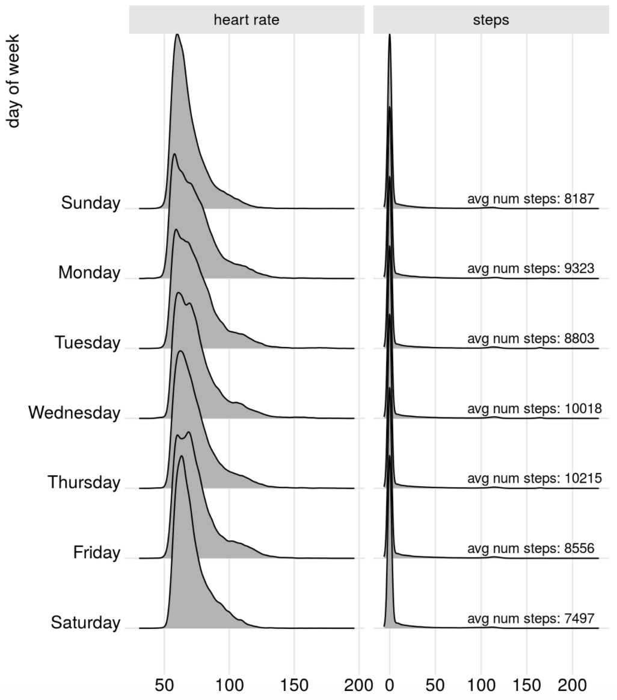
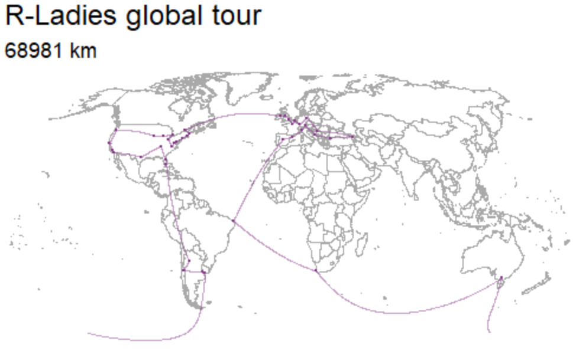

```{r packages, echo=FALSE, message=FALSE, warning=FALSE}
library(tidyverse)
```

```{r setup, include=FALSE}
# R options
options(
  htmltools.dir.version = FALSE, # for blogdown
  show.signif.stars = FALSE,     # for regression output
  warn = 1
  )
# Set dpi and height for images
knitr::opts_chunk$set(fig.height = 2.5, fig.width = 5, dpi = 300) 
# ggplot2 color palette with gray
color_palette <- list(gray = "#999999", 
                      salmon = "#E69F00", 
                      lightblue = "#56B4E9", 
                      green = "#009E73", 
                      yellow = "#F0E442", 
                      darkblue = "#0072B2", 
                      red = "#D55E00", 
                      purple = "#CC79A7")
htmltools::tagList(rmarkdown::html_dependency_font_awesome())
# For magick
dev.off <- function(){
  invisible(grDevices::dev.off())
}
# For ggplot2
ggplot2::theme_set(ggplot2::theme_bw())
```

class: center, middle

# Hello world!

---

## What is data science?

- <i class="fa fa-database fa-10x"></i> + <i class="fa fa-flask fa-10x"></i> = data science?

--

- <i class="fa fa-database fa-10x"></i> + <i class="fa fa-code fa-10x"></i> = data science?

---

## What is data science?

- <i class="fa fa-database fa-10x"></i> + <i class="fa fa-user fa-10x"></i> + <i class="fa fa-code fa-10x"></i> = data science?

---

- <i class="fa fa-database fa-10x"></i> + <i class="fa fa-users fa-10x"></i> + <i class="fa fa-code fa-10x"></i> = data science?

---

<br>

Data science is an exciting discipline that allows you to turn raw data into understanding, insight, and knowledge. We're going to learn to do this in a `tidy` way -- more on that later!

---

# What is this course?

This is a course on introduction to data science, with an emphasis on statistical thinking.

--

**Q - What data science background does this course assume?**  
A - None.

--

**Q - Is this an intro stat course?**  
A - While statistics $\ne$ data science, they are very closely related and have tremendous of overlap. Hence, this course is a great way to get started with statistics. However this course is **not** your typical high school statistics course.

--

**Q - Will we be doing computing?**   
A - Yes.

...

---

# What is this course?

**Q - Is this an intro CS course?**  
A - No, but many themes are shared.

--

**Q - What computing language will we learn?**  
A - R.

--

**Q: Why not language X?**  
A: We can discuss that over `r emo::ji("coffee")`.


---

class: center, middle

# Data in the wild

---

# A year as told by fitbit

.pull-left[
by Nick Strayer

http://livefreeordichotomize.com/2017/12/27/a-year-as-told-by-fitbit/
]
.pull-right[

]
---

# R-Ladies global tour

.pull-left[
by Maelle Salmon

http://www.masalmon.eu/2017/10/06/globalrladiestour/
]
.pull-right[

]


---

# Text analysis of Trump's tweets confirms he writes only the (angrier) Android half

.pull-left[
by David Robinson (Stack Overflow)

http://varianceexplained.org/r/trump-tweets/
]
.pull-right[

]

---

class: center, middle

# Your turn!

---

## Create a GitHub account

Go to https://github.com/, and create an account (unless you already have one). Tips for selecting a username:<sup>1</sup>

.small[
- Incorporate your actual name so that people can remember your GitHub handle easily.
- Reuse username from other contexts if you can, e.g., Twitter or Slack.
- Pick a username you will be comfortable revealing to your future boss.
- Shorter is better than longer.
- Be as unique as possible in as few characters as possible.
- Make it timeless. Don’t highlight your current university, employer, or place of residence.
- Avoid words laden with special meaning in programming, like `NA`.
]

.footnote[ 
[1] Source: [Happy git with R](http://happygitwithr.com/github-acct.html#username-advice) by Jenny Bryan
]

.instructions[
Please let me know when you've completed this step.
]

---

## Join RStudio.cloud

Go to [http://rstudio.cloud](http://rstudio.cloud), and log in with your GitHub credentials.

.instructions[
Please let me know when you've completed this step.
]

---

## Create your first data visualization

- Once you log on to RStudio Cloud, click on this course's workspace "OER - Datascience Class"
- You should see a project called UN Votes, fork it by clicking on the <i class="fa fa-fork"></i> icon. This will create your copy of the project and launch it.
- In the Files pane in the bottom right corner, spot the file called `unvotes.Rmd`. Open it, and then click on the "Knit" button.
- Go back to the file and change your name on top (in the `yaml` -- we'll talk about what this means later) and knit again.
- Then change the country names to those you're interested in. Your spelling and capitalization should match the data so take a peek at the Appendix to see how the country names are spelled. Knit again. And voila, your first data visualization!

.instructions[
Please let me know when you've completed this step.
]

---

class: center, middle

# Course structure and policies

---

## Class meetings

- Interactive

- Some lectures, lots of learn-by-doing

- Bring your laptop to class every day

---

## How to get help

- First, there's me.
- Next there's Google, who will likely send you here:

[https://stackoverflow.com/](https://stackoverflow.com/)

Stackoverflow is a great place to find answers to both simple and complex questions. I recommend making an account so you can ask the masses when you run into an issue that isn't solved elsewhere.    

---

## Tips for asking questions

- First search existing discussion for answers. If the question has already been answered, you're done! If it has already been asked but you're not satisfied with the answer, add to the thread. 
- Give your question context from course concepts not couse assignments.
    - Good context: "I have a question on filtering"
    - Bad context: "I have a question on HW 1 question 4"
- Be precise in your description:
    - Good description: "I am getting the following error and I'm not sure how to resilve it - `Error: could not find function "ggplot"`"
    - Bad description: "R giving errors, help me! Aaaarrrrrgh!” 
- Note that you can edit a question after posting it.

---

## Tips for asking questions

- Format your questions nicely using markdown and code formatting.
- Where appropriate, provide links to specific files, or even lines within them, in the body of your issue. This will help your helper understand your question. Note that only the teaching team will have access to private repos.
- (Optional) Tag someone or some group of people. Start by typing the @ symbol and GitHub will generate some good suggestions. 
 